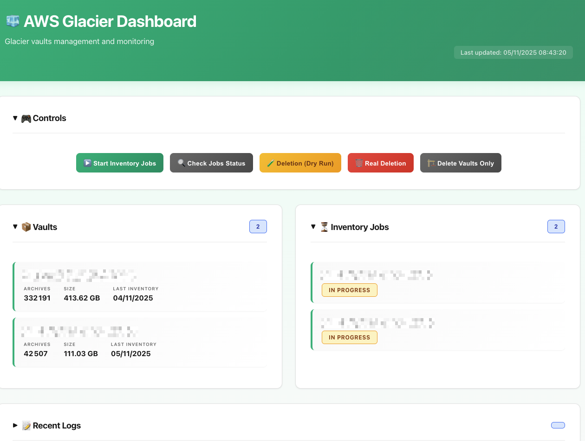

# AWS Glacier Vault Management

Scripts to automate the complete deletion of AWS Glacier vaults and their archives.

## 📁 Project Files

### Main Scripts
- **glacier.json**: List of Glacier vaults to process (6 vaults)
- **init_glacier_inventory.sh**: Launches inventory jobs for all vaults
- **check_glacier_jobs.sh**: Checks the status of jobs
- **delete_glacier_auto.sh**: Deletes archives and vaults

### 🎨 Web Dashboard
- **dashboard_server.py**: Web server with REST API
- **dashboard.html**: Interactive graphical interface
- **start_dashboard.sh**: Dashboard launch script

### 🐳 Docker (NEW)
- **Dockerfile**: Docker image with all necessary tools
- **docker-compose.yml**: Docker Compose configuration
- **docker-start.sh**: Docker startup script
- **docker-stop.sh**: Docker stop script
- **docker-shell.sh**: Shell access in the container
- **Makefile**: Simplified commands
- **.env.example**: Configuration example

## 🐳 Docker Deployment ⭐ NEW

**Complete containerized solution - The easiest way to get started!**

### Why Docker?

✅ **Portable**: Works everywhere (macOS, Linux, Windows)
✅ **Isolated**: No conflicts with your system
✅ **Pre-configured**: AWS CLI, jq, Python already installed
✅ **Persistent**: Your data remains even after shutdown
✅ **Simple**: One command to launch everything

### Quick Installation

```bash
# 1. Check that Docker is installed
docker --version

# 2. Launch everything with Docker Compose
./docker-start.sh

# 3. Open the dashboard
# http://localhost:8080
```



That's it! 🎉

### Using with Docker

**With shell scripts:**
```bash
# Start
./docker-start.sh

# Stop
./docker-stop.sh

# View logs
docker compose logs -f

# Open a shell in the container
./docker-shell.sh
```

**With Make (even simpler):**
```bash
# View all commands
make help

# Start
make start

# View logs
make logs

# Launch inventory jobs
make init

# Check status
make check

# Deletion in dry-run mode
make delete-dry

# Stop
make stop
```

**With Docker Compose directly:**
```bash
# Build the image
docker compose build

# Start
docker compose up -d

# Real-time logs
docker compose logs -f

# Execute a script in the container
docker compose exec glacier-dashboard ./init_glacier_inventory.sh
docker compose exec glacier-dashboard ./check_glacier_jobs.sh
docker compose exec glacier-dashboard ./delete_glacier_auto.sh --dry-run

# Stop
docker compose down
```

### Docker Configuration

**Mounted volumes:**
- `~/.aws` → AWS credentials (read-only)
- `./data/glacier_inventory` → Downloaded inventories
- `./data/glacier_logs` → Persistent logs
- `./data/job_data` → Job files

**Exposed ports:**
- `8080` → Web dashboard

**Environment variables:**
Create a `.env` file from `.env.example`:
```bash
cp .env.example .env
# Edit .env if necessary
```

### Complete Docker Workflow

```bash
# 1. First time: build and start
make start

# 2. Open browser
# http://localhost:8080

# 3. Use the dashboard OR Make commands

# Option A: Via web dashboard
# - Click buttons in the interface

# Option B: Via Make
make init           # Launch inventory jobs
make check          # Check status
make delete-dry     # Test in dry-run mode
make delete         # Real deletion (asks for confirmation)

# 4. Follow logs in real-time
make logs

# 5. Stop when finished
make stop
```

### Available Make Commands

| Command | Description |
|---------|-------------|
| `make help` | Display help |
| `make build` | Build Docker image |
| `make start` | Start container |
| `make stop` | Stop container |
| `make restart` | Restart container |
| `make logs` | View real-time logs |
| `make shell` | Open shell in container |
| `make status` | Display container status |
| `make clean` | Remove container and image |
| `make init` | Launch inventory jobs |
| `make check` | Check job status |
| `make delete-dry` | Deletion in dry-run mode |
| `make delete` | Real deletion |
| `make vaults-only` | Delete only vaults |

### Advantages of Docker Version

| Local | Docker |
|-------|--------|
| Install AWS CLI manually | ✅ Already included |
| Install jq manually | ✅ Already included |
| Install Python manually | ✅ Already included |
| Manage dependencies | ✅ All pre-configured |
| Version conflicts | ✅ Isolated environment |
| Limited portability | ✅ Works everywhere |

## 🌐 Interactive Web Dashboard

**Modern graphical interface to manage your Glacier vaults from your browser!**

### Dashboard Features

✨ **Real-time monitoring**
- Visualization of all vaults and their statistics
- Tracking of inventory job status
- Progress bars for ongoing deletions
- Live logs with syntax highlighting

🎮 **Interactive control**
- Launch scripts directly from the interface
- Buttons for all operations (init, check, delete, etc.)
- Security confirmations for critical operations
- Tracking of running processes

📊 **Detailed statistics**
- Number of archives per vault
- Total data size
- Percentage progress with counters
- Log history

### Launching the Dashboard

```bash
# Launch the web server
./start_dashboard.sh
```

Then open your browser at: **http://localhost:8080**

**Expected output:**
```
============================================================
🚀 AWS Glacier Dashboard
============================================================
Server started on: http://localhost:8080
Working directory: /Users/remi/Desktop/Glacier

Open your browser at: http://localhost:8080

Press Ctrl+C to stop the server
============================================================
```

### Dashboard Screenshots

**Overview:**
- 📦 **Vaults Section**: List of all vaults with statistics
- ⏳ **Jobs Section**: Inventory job status with status badges
- 🔥 **Progress Section**: Animated progress bars for deletions
- 📋 **Logs Section**: Console with real-time logs
- ⚙️ **Controls Section**: Buttons to launch scripts

**Auto-refresh:**
The dashboard automatically refreshes every 5 seconds to display the most recent status.

### Using the Dashboard

1. **Launch the server**
   ```bash
   ./start_dashboard.sh
   ```

2. **Open browser** at http://localhost:8080

3. **Use controls**
   - Click "🚀 Launch inventory jobs" to start
   - Monitor status in "Jobs" section
   - When ready, launch deletion
   - Follow progress in real-time

4. **Stop the server**
   - Return to terminal
   - Press `Ctrl+C`

## 🚀 Complete Workflow

### Option A: With Web Dashboard (Recommended)

1. Launch dashboard: `./start_dashboard.sh`
2. Open http://localhost:8080 in your browser
3. Use buttons to control operations
4. Monitor progress in real-time

### Option B: Command Line

### Step 1: Launch Inventory Jobs

```bash
./init_glacier_inventory.sh
```

**This script:**
- Reads the `glacier.json` file
- Extracts all vaults (my_vault_1, _4, _5 and their mappings)
- Initiates an inventory job for each vault
- Saves job IDs in `job_<vault>.json` files

**Expected output:**
```
🚀 Initialization of Glacier inventory jobs
📋 Vaults found:
  - my_vault_1
  - my_vault_1_mapping
  - my_vault_2
  - ...
✅ Job launched successfully
💾 Job saved in: job_my_vault_1.json
```

### Step 2: Wait and Check Job Status

⏳ **Glacier inventory jobs typically take 3-5 hours**

Regularly check status:

```bash
./check_glacier_jobs.sh
```

**This script:**
- Reads all `job_*.json` files
- Queries AWS for each job status
- Displays a global summary

**Expected output:**
```
📦 Vault: my_vault_1
   ✅ Status: Completed successfully

📦 Vault: my_vault_2
   ⏳ Status: In progress (InProgress)

📊 SUMMARY
Total jobs: 6
✅ Completed: 1
⏳ In progress: 5
❌ Failed: 0
```

### Step 3: Delete Archives and Vaults

Once all jobs are completed:

```bash
# Dry-run mode (simulation, no deletion)
./delete_glacier_auto.sh --dry-run

# Real deletion
./delete_glacier_auto.sh
```

**This script:**
- Automatically checks that jobs are completed
- Downloads inventory for each vault
- Deletes all archives with automatic retry
- Displays progress every 25 archives
- Attempts to delete empty vaults
- Displays complete operation summary

**Expected output:**
```
📄 File: job_my_vault_1.json
➡️  Vault: my_vault_1
🔍 Checking job status...
✅ Job completed successfully
📥 Downloading inventory...
✅ Inventory saved: ./glacier_inventory/inventory_my_vault_1.json
🧨 1234 archives found in vault
🧹 Real deletion of archives...
✅ Deletion completed: 1234 successful, 0 failed
🧹 Deleting empty vault: my_vault_1
   ⚠️  Note: Deletion may fail if vault was modified less than 24h ago
❌ Failed to delete vault my_vault_1
   Possible reasons:
   - Vault was modified less than 24h ago

📊 FINAL SUMMARY
Total vaults processed: 6
✅ Vaults deleted: 0
❌ Failures: 6

⚠️  Some vaults could not be deleted.
   Wait 24h then rerun: ./delete_glacier_auto.sh --vaults-only
```

### Step 4: Delete Vaults (24h later)

⏰ **Wait 24 hours after deleting archives**

AWS Glacier requires waiting ~24h after the last modification of a vault before it can be deleted.

```bash
# Delete only empty vaults (without reprocessing archives)
./delete_glacier_auto.sh --vaults-only
```

**Expected output:**
```
🗑️  VAULTS ONLY MODE: delete only empty vaults
📦 Vault: my_vault_1
✅ Vault deleted: my_vault_1

📊 FINAL SUMMARY
Total vaults processed: 6
✅ Vaults deleted: 6
❌ Failures: 0
```

## ⚙️ Configuration

### Main Parameters

Scripts use the following parameters (modifiable in each script):

- **ACCOUNT_ID**: `-` (uses default AWS account)
- **REGION**: `eu-west-1` (region of your vaults)
- **GLACIER_JSON**: `glacier.json` (vault source file)

### Advanced Options for delete_glacier_auto.sh

Configurable parameters in the script:

- **DELAY_BETWEEN_DELETES**: `0.2` seconds (pause between each archive deletion)
- **MAX_RETRIES**: `3` attempts (number of retries on AWS error)

Command-line options:

```bash
# Simulation without deletion
./delete_glacier_auto.sh --dry-run

# Delete only empty vaults (after 24h)
./delete_glacier_auto.sh --vaults-only

# Combination of options
./delete_glacier_auto.sh --dry-run --vaults-only
```

## 📊 Vault Information

According to `glacier.json`, here are the vaults to process:

| Vault | Archives | Size | Last inventory |
|-------|----------|------|----------------|
| my_vault_1 | 1,234 | 10 GB | 2025-01-15 |
| my_vault_1_mapping | 0 | 0 B | 2025-01-15 |
| my_vault_2 | 10,000 | 100 GB | 2025-01-15 |
| my_vault_2_mapping | 5 | 50 MB | 2025-01-10 |
| my_vault_3 | 5,000 | 50 GB | 2025-01-10 |
| my_vault_3_mapping | 2 | 20 MB | 2025-01-08 |

**Total: ~160 GB of data**

## 🗂️ Generated Files

During execution, the following files will be created:

```
.
├── data/
│   ├── glacier.json                         # Vault configuration
│   ├── job_data/                            # Job files
│   │   └── job_my_vault_*.json           # Job IDs (created by script 1)
│   ├── glacier_inventory/                   # Inventories and progress
│   │   ├── inventory_my_vault_*.json     # Downloaded inventories (originals)
│   │   ├── inventory_my_vault_*.working.json # Working copies (resume)
│   │   └── .progress_my_vault_*          # Progress files
│   └── glacier_logs/                        # Persistent logs
│       └── deletion_YYYYMMDD_HHMMSS.log     # Timestamped log of each execution
├── scripts/
│   ├── init_glacier_inventory.sh            # Script 1
│   ├── check_glacier_jobs.sh                # Script 2
│   └── delete_glacier_auto.sh               # Script 3
└── web/
    ├── dashboard_server.py
    └── dashboard.html
```

**Note:** `.working.json` and `.progress_*` files are automatically cleaned once the vault is emptied.

## ⚠️ Warnings

- Archive deletion is **irreversible**
- Use `--dry-run` to test before real deletion
- Inventory jobs take several hours (3-5h on average)
- AWS Glacier charges for early deletions (< 90 days of storage)
- Make sure you have the necessary IAM permissions:
  - `glacier:InitiateJob`
  - `glacier:DescribeJob`
  - `glacier:GetJobOutput`
  - `glacier:DeleteArchive`
  - `glacier:DeleteVault`

## 🔧 Prerequisites

### For CLI Scripts
- AWS CLI installed and configured
- `jq` installed (for JSON parsing)
- Bash 4.0+
- AWS credentials configured (`~/.aws/credentials` or environment variables)

### For Web Dashboard (optional)
- Python 3.6+ (usually pre-installed on macOS)
- Modern web browser (Chrome, Firefox, Safari, Edge)

**Check prerequisites:**
```bash
# Check AWS CLI
aws --version

# Check jq
jq --version

# Check Python 3
python3 --version

# Check AWS credentials
aws sts get-caller-identity
```

## 🚀 Advanced Features

### 🔄 Resume After Interruption ⭐ NEW

**The script can be interrupted and resumed without losing progress!**

How it works:
- Each deleted archive is **immediately removed** from the working JSON file
- In case of interruption (Ctrl+C, crash, connection loss), state is saved
- On restart, the script **resumes exactly where it left off**
- Only remaining archives are processed

**Example:**
```bash
# Initial launch
./delete_glacier_auto.sh

# Script interrupted after 10,000/10,000 archives
# [Ctrl+C or crash]

# Resume - only the remaining 8,766 archives will be processed
./delete_glacier_auto.sh
🔄 Resume detected: using existing working inventory
🔄 Resume: 10000/10000 archives already deleted
🧨 8766 archives found in vault
```

**Resume files:**
- `glacier_inventory/inventory_<vault>.working.json`: inventory updated in real-time
- `glacier_inventory/.progress_<vault>`: progress counter

These files are automatically cleaned once the vault is completely emptied.

### 📋 Persistent Logs ⭐ NEW

**Complete traceability of all operations**

The script generates a timestamped log file for each execution:
- Format: `glacier_logs/deletion_YYYYMMDD_HHMMSS.log`
- All events are logged: starts, deletions, errors, completions
- Structured format: `[timestamp] [level] message`
- Levels: INFO, WARN, ERROR

**Log example:**
```
[2025-11-02 14:30:15] [INFO] === Starting Glacier deletion script ===
[2025-11-02 14:30:15] [INFO] Log file: ./glacier_logs/deletion_20251102_143015.log
[2025-11-02 14:30:16] [INFO] Processing vault: my_vault_2
[2025-11-02 14:30:20] [INFO] 10000 remaining archives in vault my_vault_2
[2025-11-02 14:30:25] [INFO] Progress: 100/10000 archives processed
[2025-11-02 15:45:30] [WARN] Script interrupted by user (Ctrl+C)
[2025-11-02 15:45:30] [INFO] Progress has been saved. Rerun the script to resume.
```

**Ctrl+C handling:**
The script properly intercepts interruptions and saves state before exiting.

### ✅ Automatic Job Verification

The `delete_glacier_auto.sh` script automatically checks that inventory jobs are completed before downloading data. If a job is not ready, it moves to the next one.

### 🔁 Retry System

In case of deletion error (AWS throttling, network errors), the script automatically retries up to 3 times with a 2-second pause between each attempt.

### 🛡️ Rate Limiting Protection

The script adds a 0.2-second pause between each archive deletion to avoid being throttled by AWS. This delay is particularly important for the vault with 10,000 archives.

### 📊 Real-time Progress with ETA

For vaults containing many archives, the script displays progress every 25 archives with estimated time remaining:
```
Progress: 100/10000 archives (1.85/s, ETA: 89min)...
Progress: 200/10000 archives (1.92/s, ETA: 85min)...
```

### 📈 Detailed Statistics

At the end of execution, the script displays:
- Total number of vaults processed
- Number of successfully deleted vaults
- Number of failures
- For each vault: number of successful vs failed archives
- Path to complete log file

### 🧹 Automatic Cleanup

Once a vault is completely deleted, all temporary files are automatically cleaned:
- `job_<vault>.json`
- `inventory_<vault>.json`
- `inventory_<vault>.working.json`
- `.progress_<vault>`

### ✔️ JSON Validation

The script validates the JSON structure of inventories before processing them, avoiding silent errors.

## 📝 Notes

- Vaults must be completely empty before they can be deleted
- A vault can only be deleted 24h after the last write operation
- Glacier inventories are updated approximately every 24h
- Deleting ~10k archives can take 1-2 hours (with anti-throttling pauses)
- **The script can be interrupted at any time**: progress is saved automatically
- Logs are kept in `./glacier_logs/` for audit and debugging
- Downloaded inventories are kept in `./glacier_inventory/` and reused when running `--vaults-only`

## 🆘 Common Scenarios

### The script crashes or I need to interrupt it

**Don't panic!** Simply relaunch the script:
```bash
./delete_glacier_auto.sh
```
It will automatically resume where it left off.

### I want to see what happened during the previous execution

Check the latest log file:
```bash
ls -lt glacier_logs/
cat glacier_logs/deletion_*.log
```

### The script is too slow

You can adjust parameters in the script:
- `DELAY_BETWEEN_DELETES=0.2` → reduce to `0.1` (beware of AWS throttling)
- `MAX_RETRIES=3` → reduce to `1` to go faster

### I want to manually clean up after tests

```bash
# Clean working inventories
rm -f data/glacier_inventory/*.working.json data/glacier_inventory/.progress_*

# Clean all logs
rm -rf data/glacier_logs/

# Clean all job files
rm -rf data/job_data/
```
